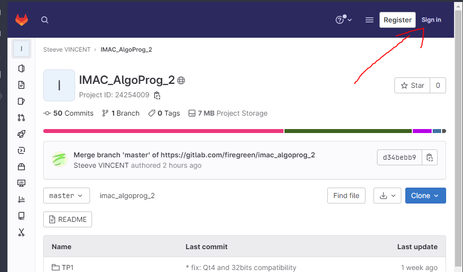
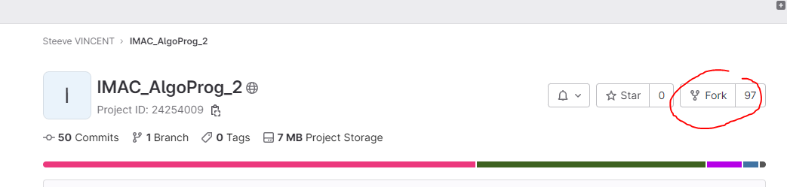
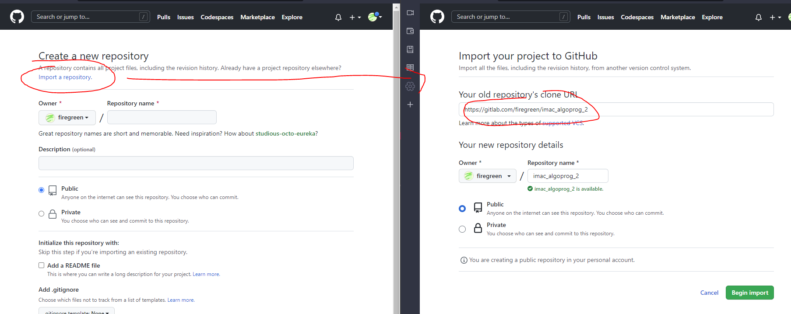

# Programming and Algorithms for Esipe - IMAC courses

This repository is for learning some algorithms withing the [IMAC](https://www.ingenieur-imac.fr/) 
courses for the second semester. To attend the courses, please fork this repository,
you have to Sign In to do so, then click [into fork](https://gitlab.com/firegreen/imac_algoprog_2/-/forks/new):




If you prefer *Github*, [you can import the repository](https://github.com/new/import) 


## INSTALL

To run these exercises, I provide so sources code which need Qt to be run.
It allows to display the conduct and purpose of the algorithms.

If you want to use the provided code, please install Qt development toolkit 
and QtCreator IDE.
The simplest way is to use a Linux system and use the package manager.

### Linux

```bash
sudo apt-get install qtbase5-dev qtchooser qt5-qmake qtbase5-dev-tools qtcreator
```

### Windows

For Windows there is some installer, the current community version of Qt need
to sign up and is really heavy, so I choose to put links to an older version of Qt.

[install_qt_windows.md](install_qt_windows.md)

### Mac OS

A tutorial has been done for macOS by a Student Sara Lafleur

[Installation_MacOS_QtCreator.pdf](docs/Installation_MacOS_QtCreator.pdf)

## RUN

For each session, you will find a folder with the current session name and within you will get some source files,
especially some *.cpp files you will modify to make the exercises and *.pro to open with `QtCreator` to configure
the compilation and run each exercises

## SEND THE CODE

To send the code, use git to update your remote repository. You can use a Git Client Software to do so, here is some
clients:

 * https://tortoisegit.org/  (Only Windows)
 * https://git-fork.com/ (Mac and Windows)
 * https://www.gitkraken.com/ (Free for public repo)
 * https://desktop.github.com/ (Only for Github repo ?)
 * https://gitextensions.github.io/

You can also run git command in a shell

```bash
git add TP1/exo1.cpp
git commit -m "I finished the first exercise"
git push
```

## GET TEACHER UPDATES

Sometimes I update this repo to fix some code, add documentation, change subject 

Please get these updates with these git commands

```bash
git remote add upstream "https://gitlab.com/firegreen/imac_algoprog_2"
git fetch upstream
git pull upstream master
```
