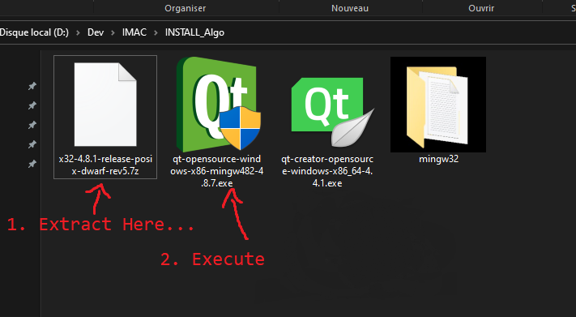
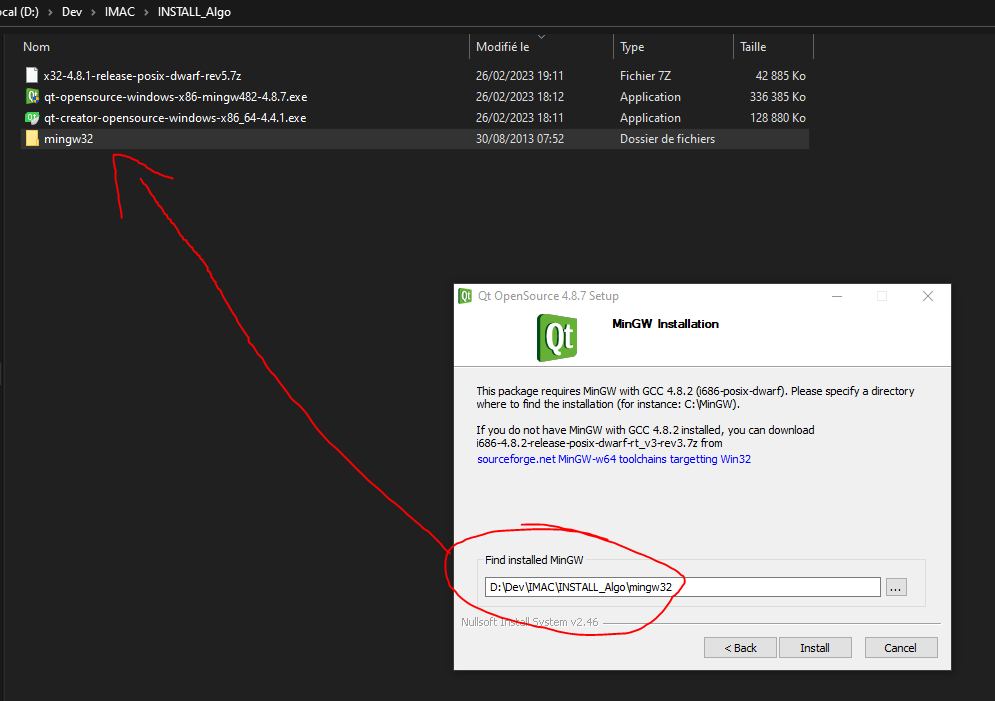
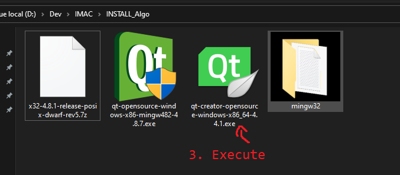
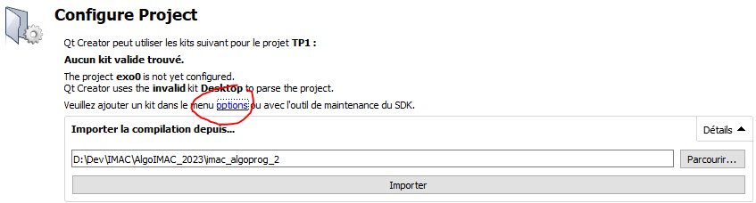
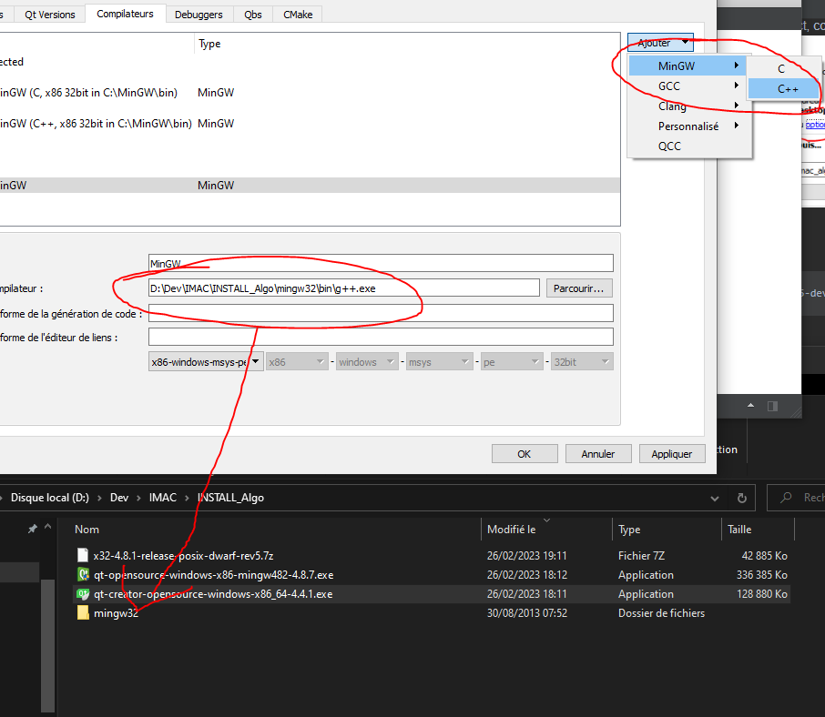
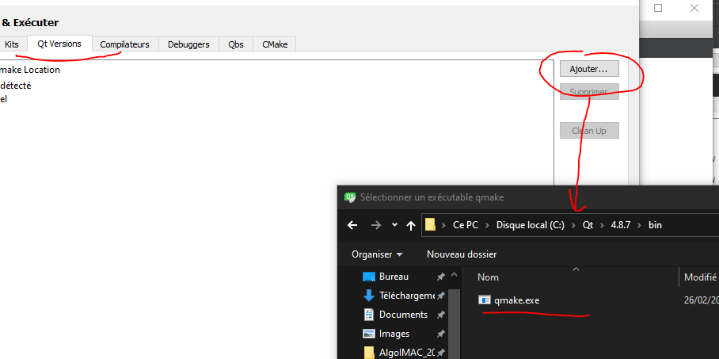
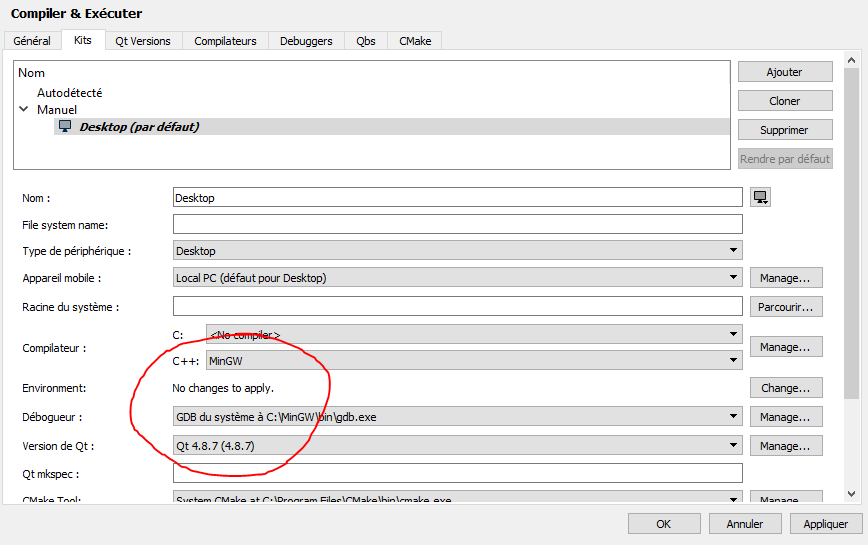

Please download these files, you should install this version of mingw, it is compatible with
Qt4. 

 * https://sourceforge.net/projects/mingwbuilds/files/host-windows/releases/4.8.1/32-bit/threads-posix/dwarf/x32-4.8.1-release-posix-dwarf-rev5.7z/download
 * https://download.qt.io/archive/qt/4.8/4.8.7/qt-opensource-windows-x86-mingw482-4.8.7.exe
 * https://download.qt.io/archive/qtcreator/4.4/4.4.1/qt-creator-opensource-windows-x86_64-4.4.1.exe

Just follow the installation and skip the sign in part.

When you open your first project, configure the compilation kit by using the installed
Qt4 and MinGW

Add a C++ configuration

Add a Qt

Finally, configure the kit
